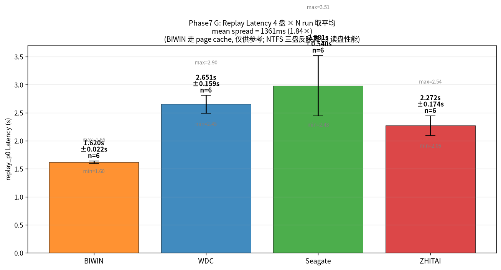
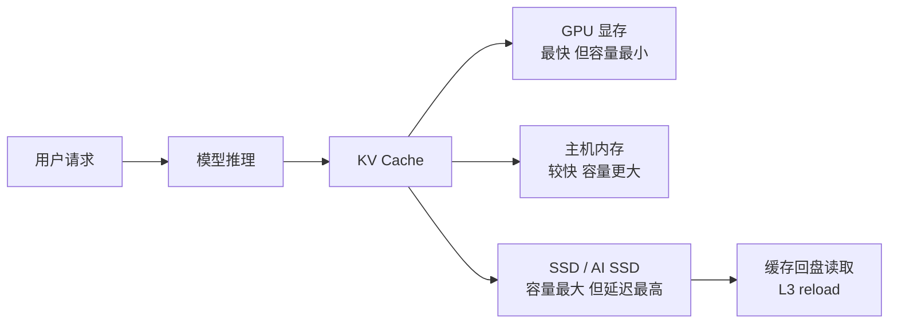
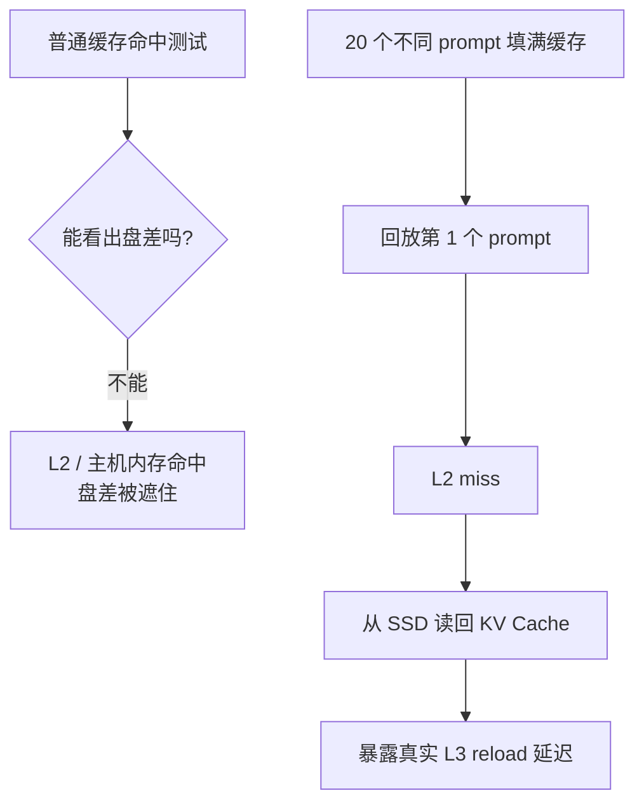
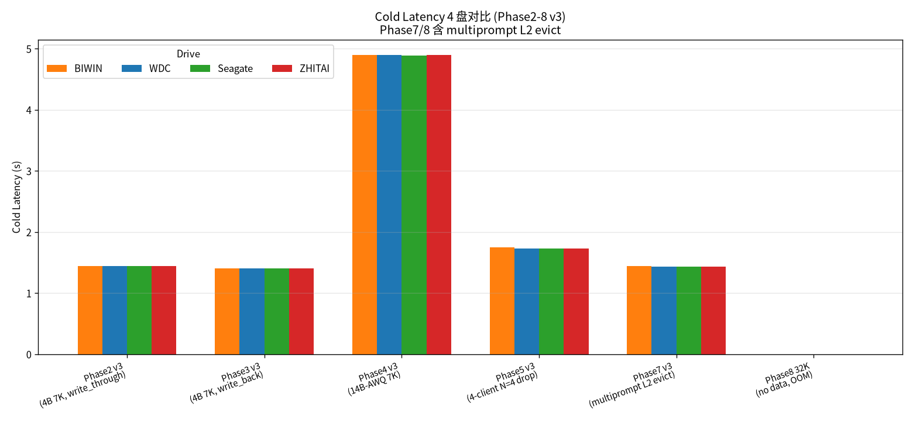
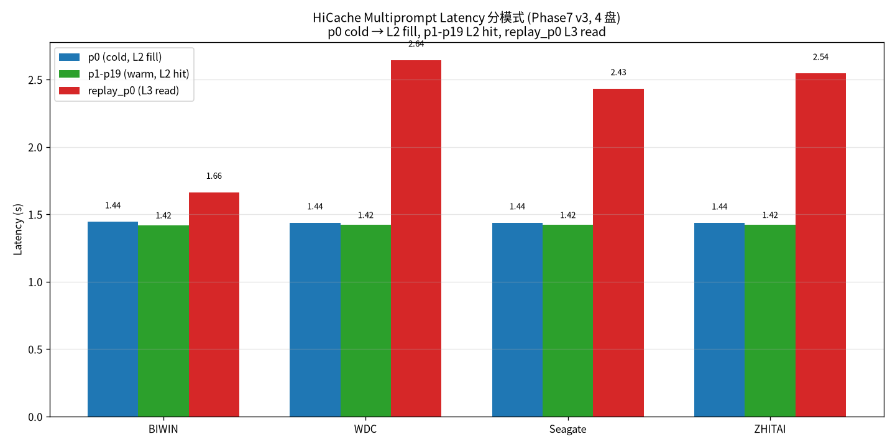
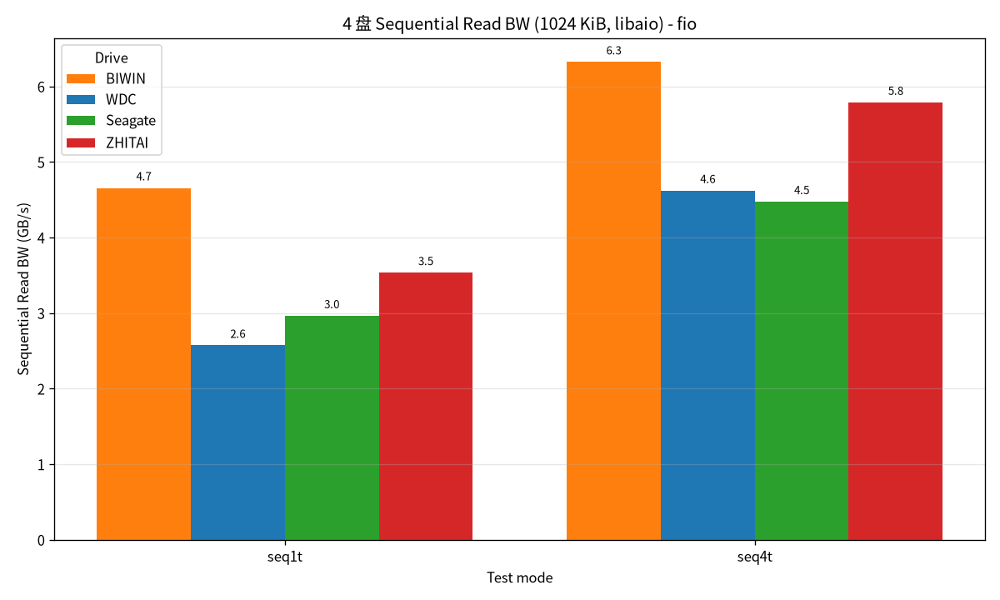
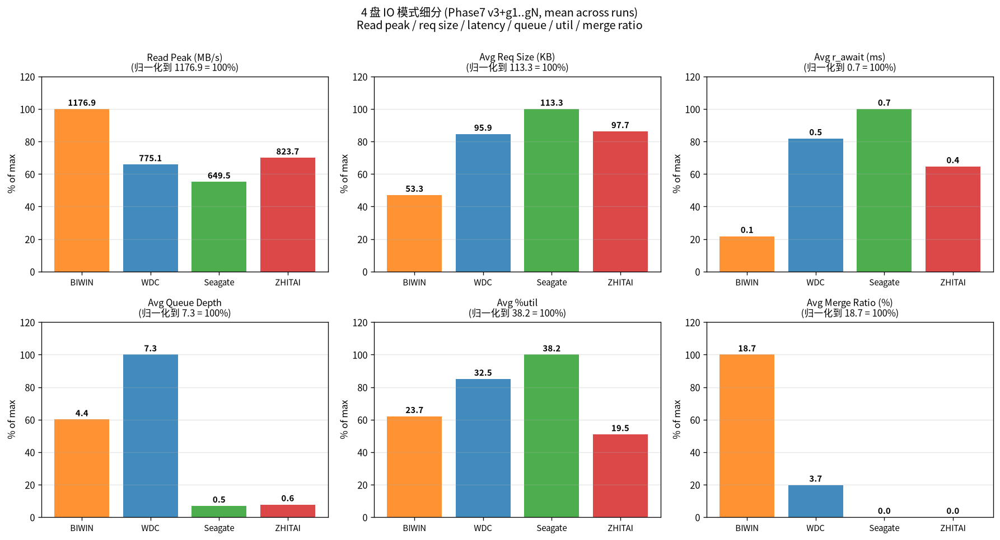
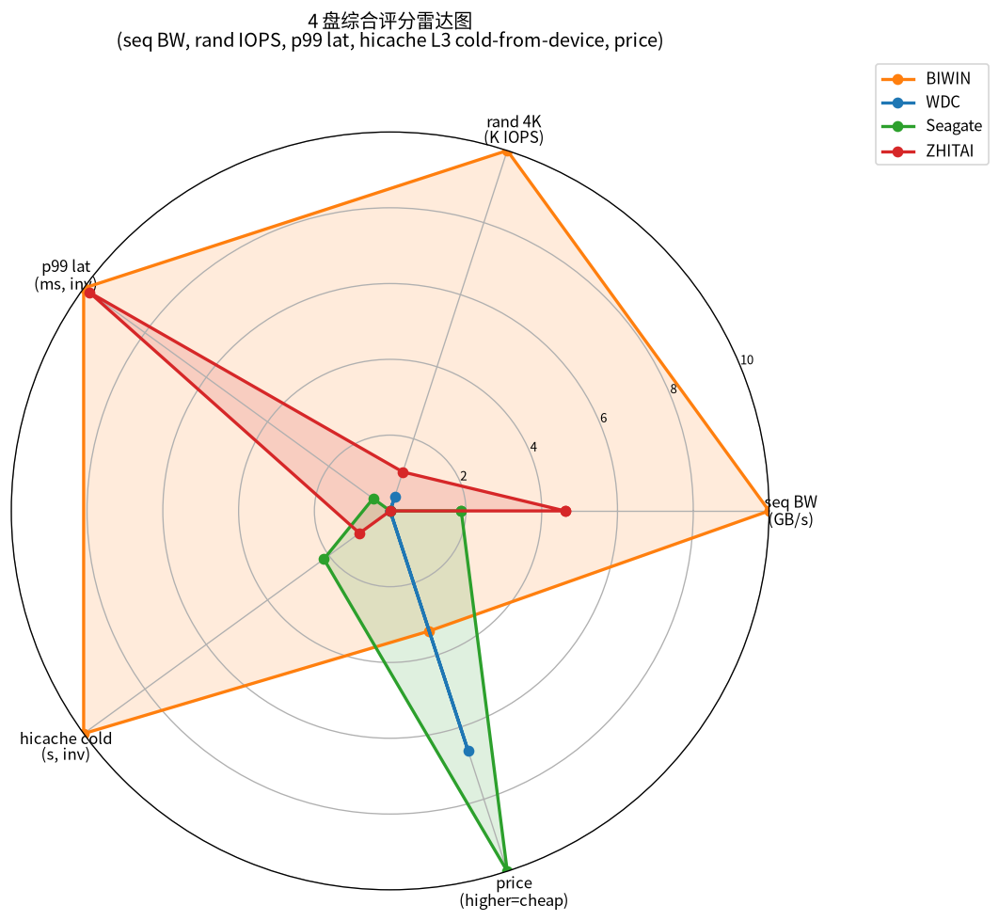

# AI SSD 预研简报

> 面向老板的版本：讲清楚 AI SSD 是什么、为什么要看它、我们测到了什么、下一步该往哪里做。

## 0. 阅读路径

这份报告建议按下面顺序看：

1. 先看 **图 1**：真正拉开盘差的是 L3 reload
2. 再看 **图 2/3**：AI SSD 在系统里的位置，以及为什么要做多 prompt 回放
3. 再看 **图 4-7**：为什么不能只看硬盘跑分
4. 最后看 **图 8**：选型建议

## 1. 一句话结论

AI SSD 不是单纯比“硬盘有多快”，而是看它在 **AI 推理读取缓存** 时，能不能把延迟压住。

这次实验的结果很明确：

- 早期 LMCache 测试证明：KV Cache 落盘确实能显著加速重复请求
- **缓存命中时**，4 块盘几乎看不出差别
- **缓存没命中、需要从盘里重新读 KV Cache 时**，4 块盘差异非常明显
- 真正值得优化的，不是“峰值带宽”，而是 **L3 reload 延迟、文件系统、读路径组织方式**

**图 1：多轮 L3 reload 对比。**  
这张图最重要。它说明单次测试不够稳定，要看多轮平均。ZHITAI 整体更快，WDC 中等，Seagate 波动更大。

## 2. AI SSD 是什么

通俗讲，AI 推理时模型会产生一类中间数据，叫 **KV Cache**。
如果这些数据一直放在 GPU 显存里，容量不够；所以系统会把它往外挪：

1. GPU 显存
2. 主机内存
3. SSD

AI SSD 的作用，就是做第 3 层存储。  
它不是拿来存文档的，而是拿来存“模型推理用的热数据”。

**图 2：KV Cache 分层。**  
AI SSD 处在最底层。只有当 GPU 显存和主机内存放不下、需要从 SSD 重新读缓存时，SSD 的差异才会真正影响用户体验。

## 3. 为什么这个问题重要

如果 AI SSD 慢，模型每次重新加载缓存时就会卡住，用户看到的就是：

- 首次响应慢
- 重新问同样问题时，还是慢
- 多轮对话、长上下文场景下体验不稳定

所以 AI SSD 关心的不是“拷文件快不快”，而是：

- **读缓存时快不快**
- **延迟稳不稳**
- **并发时会不会掉得很厉害**

## 4. 我们怎么测的

这次主要做了四类测试：

1. **LMCache 早期测试**  
   用 vLLM + LMCache 验证 KV Cache 落盘是否真的有价值。

2. **HiCache 常规测试**  
   看模型推理时，缓存命中和不命中时的表现。

3. **多 prompt 累积 + 回放测试**  
   先把缓存塞满，再回放最早的请求，强制它从 SSD 重新读。  
   这一步最能看出盘差。

4. **fio 直测盘性能**  
   不经过推理框架，直接测 SSD 本身有多快。  
   这是“硬件上限”参考。

**图 3：为什么要做多 prompt 回放。**  
普通测试大多命中内存，看不出 SSD 差异。必须把缓存塞满，再回放旧请求，才能逼出 SSD 读取。

## 5. 实验结果

### 5.1 LMCache 证明：KV Cache 落盘有价值

早期用 vLLM + LMCache 做过一轮测试。  
同一个 7000 token prompt，第一次请求需要完整计算，后面请求命中缓存。

结果是：

| 指标 | 结果 |
|---|---:|
| 首次请求 TTFT | 约 0.78s |
| 缓存命中后 TTFT | 约 0.034s |
| 加速比 | 约 23 倍 |
| 单次请求落盘数据 | 约 0.95 GB |

这说明 KV Cache offload 这个方向是成立的。  
只要命中缓存，模型可以少做大量重复计算，响应会明显变快。

但这组数据也有边界：LMCache 会优先命中 CPU 内存缓存，所以它更适合说明“缓存机制有价值”，不适合作为最终 AI SSD 盘型排名。

### 5.2 缓存命中时，盘差很小

**图 4：不同测试阶段的盘差。**  
常规缓存命中阶段，4 块盘差距很小；只有进入 L3 reload，差距才明显放大。

在普通的 4B / 14B 测试里，4 块盘的 TTFT 差距只有几毫秒到几十毫秒。

这说明：

- 只要缓存还在主机内存里，SSD 好坏几乎看不出来
- 这类测试不适合直接拿来选 AI SSD

### 5.3 真正拉开差距的是“从盘里重新读”

**图 5：多 prompt 场景下的回放延迟。**  
这张图展示了从 SSD 读回 KV Cache 后，各盘延迟开始拉开。

在多 prompt 累积后回放最早请求时，结果变得很清楚：

| 盘 | v3 单轮回放延迟 | 6 run 均值 |
|---|---:|---:|
| BIWIN ext4 | **1.66s** | **1.62s** |
| ZHITAI NTFS | 2.55s | **2.27s** |
| WDC NTFS | 2.64s | 2.65s |
| Seagate NTFS | 2.43s | **2.98s** |

v3 单轮最好的和最差的差 **0.98 秒**。6 run 后差 **1.36 秒**。单轮里 Seagate 看起来不错,但多轮均值最慢,说明选型必须看稳定性和 tail。

这说明 AI SSD 的关键不是“能不能跑分高”，而是 **缓存回盘时的真实延迟**。

### 5.4 SSD 本身的上限其实很高

**图 6：fio 直接测出来的硬盘带宽。**  
硬盘本身能跑到 GB/s 级别，但推理框架实际用到的远低于这个上限。

fio 直接测盘，顺序读可以到：

- BIWIN：4.8 GB/s
- ZHITAI：3.6 GB/s
- Seagate：3.0 GB/s
- WDC：2.6 GB/s

但推理框架真正用到的，远低于这个上限。  
也就是说，当前瓶颈更多在 **软件读路径**，不是 SSD 物理速度。

**图 7：IO 模式拆解。**  
盘没有被打满，差异更多来自请求延迟、文件系统和读路径，而不是纯带宽不足。

## 6. 这次实验说明了什么

### 6.1 先看缓存是否命中，再看 SSD 性能

LMCache 和 HiCache 的结果合在一起看，结论很清楚：

- 命中缓存时，收益非常大
- 命中主机内存时，SSD 差异很小
- 真正需要 AI SSD 发力的，是主机内存放不下、必须从盘里读的时候

所以 AI SSD 的预研不能只做普通压测，必须设计能触发“回盘读取”的场景。

### 6.2 选 AI SSD，不能只看峰值带宽

峰值带宽高，不代表推理时就快。  
真正重要的是：

- 小文件/大 page 读取时的延迟
- 多次读取时的稳定性
- 文件系统和驱动的开销

### 6.3 文件系统会影响体验

实验里，ext4 的 BIWIN 表现最好，NTFS 三块盘整体慢一些。

这说明 AI SSD 不是“只看盘颗粒”，还要看：

- 文件系统
- 挂载方式
- 读写路径的实现

### 6.4 缓存策略比想象中更重要

只要缓存命中，盘差就会被掩盖。  
所以系统设计上，如果能尽量减少 L2 miss，用户体验会好很多。

## 7. 给老板的建议方向

**图 8：综合选型雷达图。**  
选 AI SSD 不能只看一个指标，要同时看 L3 reload 延迟、稳定性、容量、成本和软件适配。

### 方向 1：把“低延迟读取”作为 AI SSD 的核心指标

以后不要只看顺序读峰值，应该重点看：

- 缓存回盘延迟
- p99 延迟
- 并发下的稳定性

### 方向 2：把缓存命中率作为系统级指标

LMCache 的 23 倍加速说明，缓存命中本身非常有价值。  
所以 AI SSD 不应只作为单盘项目看，而应和缓存系统一起优化：

- 提高命中率
- 减少无效落盘
- 让热数据尽量留在更快的层级

### 方向 3：优化软件读路径

实验已经说明，SSD 还没跑满，软件就先慢了。  
下一步更值得投的是：

- 文件系统优化
- 读路径并发
- page size 和分块方式

### 方向 4：继续做更接近真实业务的测试

建议后续继续补三类测试：

1. 更大模型
2. 更长上下文
3. 更多并发请求

这样才能更接近真实线上场景。

## 8. 最终结论

如果把这次预研压缩成一句话：

**AI SSD 的价值，不在于“跑分更高”，而在于“模型缓存重新读取时更快、更稳”。**

当前最值得关注的，是 **L3 reload 延迟**，而不是单纯的峰值带宽。

## 9. 一页版结论

| 问题 | 结论 |
|---|---|
| AI SSD 要解决什么？ | 解决 KV Cache 从 SSD 读回时的延迟问题 |
| LMCache 证明了什么？ | 缓存命中能让 TTFT 提升约 23 倍 |
| HiCache 证明了什么？ | 真正盘差只在 L3 reload 时出现 |
| 选型看什么？ | L3 reload 延迟、稳定性、p99、文件系统和读路径 |
| 当前方向 | 优先优化软件读路径和缓存命中率，再看 SSD 型号 |
