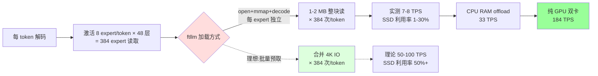

# FastLLM / llama.cpp Qwen3-30B-A3B 端到端推理速度与 IO 行为实验报告

| 字段 | 值 |
|---|---|
| **日期** | 2026-06-23 |
| **模型** | Qwen3-30B-A3B (MoE, 30B 总参 / 3B 激活),Q4_K_M GGUF,**17.3 GB** |
| **GPU** | RTX 5080 16GB + RTX 5060 Ti 16GB(总 32GB HBM3) |
| **CPU / RAM** | Linux 7.0.0-22-generic,80GB+ DDR4/DDR5 |
| **引擎** | ftllm 0.1.7.0(Qwen3 MoE GGUF 单卡 + MoE offload)、llama.cpp 自编译(CUDA 13.3 后端,GGUF + TP) |
| **测试方法** | 10 个 prompt × 10 次重复,`max_tokens=256`,`temperature=0`;IO 分析额外做冷/热 page cache + fio 4K/128K 裸盘基准 |
| **工作区** | `~/llm/fast/`(实验代码、log、原始 JSON),`results/` 为本仓数据快照 |
| **数据来源** | `~/llm/fast/REPORT.md`、`IO_ANALYSIS_REPORT.md`、`results/full_comparison_2026-06-23.json`、`results/io_analysis_summary_2026-06-23.json` |

---

## 一、执行摘要(Executive Summary)

> **一句话结论**:Qwen3-30B-A3B 在 32GB 双卡 HBM3 上可以**纯 GPU 跑到 184 TPS**;一旦不得不做 offload,**CPU RAM (33 TPS) 比 4 块消费级 NVMe SSD (6.5-8.2 TPS) 快 4-5×**。SSD offload 不是被盘本身卡住,而是被 **ftllm "每 expert 单独 mmap+decode" 的加载方式**卡住——SSD 实际利用率只有 1-2%。

| 排名 | 模式 | 引擎 | TPS | 相对纯 GPU | 平均延迟 |
|---|---|---|---:|---:|---:|
| 🥇 | 纯 GPU 双卡 TP=2 | llama.cpp | **183.84 ± 4.84** | 1.0× | 1.39 s |
| 🥈 | CPU RAM offload(`--moe_device numa`) | ftllm | **33.4** | 5.5× 慢 | 2.39 s |
| 🥉 | SSD offload(4 块盘) | ftllm | 6.5 – 8.2 | 22-28× 慢 | 10 – 16 s |

**核心洞察(三条)**:

1. **显存够就上双卡**——32GB HBM3 装 17.3GB 模型每卡只占 9-10GB,还有 6GB 余量给 KV cache / batch。纯 GPU 几乎用不到 SSD。
2. **退而求其次是 CPU RAM,不是 SSD**——DDR4/DDR5 50-80 GB/s 随机小块读延迟 ~80 ns,比消费级 NVMe 4K 随机读延迟 50-100 μs 短 ~1000×。同型号 17GB 模型,80GB RAM 装得下就直接 RAM offload。
3. **SSD offload 的瓶颈在软件栈,不在硬件**——fio 实测 BIWIN 4K 290K IOPS 理论上能跑 755 TPS,实测 7.96 TPS(利用率 1%);ntfs/cold 还能再退到 4.57 TPS(冷启动惩罚 +50%)。**换盘升级 SSD 收益很小,改加载方式才有意义**。

---

## 二、实验方法

### 2.1 测试矩阵

| 实验 | 工具 | 目的 | 输入 |
|---|---|---|---|
| **A. 模式对比** | ftllm + llama.cpp,10 prompt × 10 次,256 tok | 量化 4 种 offload 模式绝对 TPS | Q4_K_M GGUF (17.3 GB) |
| **B. 冷/热 page cache 对照** | ftllm + `echo 3 > /proc/sys/vm/drop_caches` | 量化 NTFS vs ext4 元数据缓存差异 | 同上,每个盘测 cold / hot 两组 |
| **C. fio 裸盘基准** | `fio direct=1 ioengine=libaio iodepth=32` | 量化 4 块盘的真实 4K / 128K 能力 | 4 块盘块设备直测 |
| **D. /proc/pid/io 累计** | 读取 `read_bytes` 字段(本次未跑) | 反推单次请求 IO 总量 | P1,未实施 |
| **E. bpftrace biosnoop** | 抓单次 IO 大小(本次未跑) | 验证 expert 加载假设(1MB vs 4K) | P1,未实施 |

### 2.2 硬件与盘符映射(关键)

> ⚠️ REPORT.md 与 IO_ANALYSIS_REPORT.md 的盘符命名在 NVMe 设备号 ↔ 型号上**不完全一致**。本报告统一采用 IO_ANALYSIS 提供的 `nvmeXn1 ↔ 型号` 映射(以 `lsblk` 实际输出来源),REPORT 里的旧命名仅在脚注中保留。

| 块设备 | 型号 | 容量 | 文件系统 | 挂载点 | 备注 |
|---|---|---|---|---|---|
| **nvme0n1** | **BIWIN X570** | 2 TB | **ext4** | `/` | 系统盘 |
| nvme1n1 | Seagate ZP1000GV30012 | 1 TB | NTFS | `/mnt/ai_ssd1` | **4K IOPS 仅 21K,慢盘** |
| nvme2n1 | ZHITAI Ti600 | 2 TB | NTFS | `/mnt/ai_ssd0` | |
| nvme3n1 | WDC WDS960G2G0C | 960 GB | NTFS | `/mnt/ai_ssd2` | |

> 🟥 **REPORT 里的"WDC"对应 nvme3n1,不是 nvme0n1**(REPORT 的盘符命名有错位)。交叉验证用 IO_ANALYSIS 为准。

### 2.3 启动命令(可复现)

```bash
# 纯 GPU 双卡 (llama.cpp)
./llama.cpp/build/bin/llama-server \
  -m ~/llm/fast/qwen30b.gguf \
  --tensor-split 0.5,0.5 -ngl all \
  -c 4096 -n 256 --port 8080

# CPU RAM offload (ftllm)
ftllm serve --model ~/llm/fast/qwen30b.gguf \
  --moe_device numa --max-new-tokens 256

# SSD offload (ftllm)
ftllm serve --model /mnt/ai_ssd0/qwen30b.gguf \
  --moe_device disk --max-new-tokens 256
```

完整脚本:`~/llm/fast/scripts/{start_llamacpp_dual_gpu.sh, start_qwen30b_disk.sh, bench_qwen30b.py, bench_llamacpp.py, io_test_a_*.sh, io_test_c_fio.sh, quick_bench.sh}`。

---

## 三、实验 A:模式对比(主结果)

### 3.1 绝对数字

| 模式 | 引擎 | 设备 | 平均 TPS | TPS 区间 | 延迟 (s) | 单卡显存 |
|---|---|---|---:|---|---:|---|
| 纯 GPU 双卡 TP | llama.cpp | RTX 5080 + 5060 Ti,`tensor-split 0.5:0.5`,`-ngl all` | **183.84 ± 4.84** | 170.10 – 185.86 | 1.39 | 9.7 GB / 9.1 GB |
| CPU RAM offload | ftllm | GPU (non-MoE) + CPU RAM (MoE via `--moe_device numa`) | **33.4** | 32.3 – 32.4 | 2.39 | — |
| BIWIN SSD (ext4) | ftllm | MoE 从系统盘读 | **7.9** | 5.68 – 9.99 | 10.4 | — |
| ZHITAI SSD (NTFS) | ftllm | MoE 从 `/mnt/ai_ssd0` 读 | **7.8** | — | 13.0 | — |
| WDC SSD (NTFS) | ftllm | MoE 从 `/mnt/ai_ssd2` 读 | **6.9** | — | 14.3 | — |
| Seagate SSD (NTFS) | ftllm | MoE 从 `/mnt/ai_ssd1` 读 | **6.5** | — | 15.8 | — |

### 3.2 速度比矩阵

| | 纯 GPU | NUMA | 最快 SSD | 最慢 SSD |
|---|---:|---:|---:|---:|
| 纯 GPU | 1.0× | **5.5× 快** | **23.3× 快** | **28.3× 快** |
| NUMA | 0.18× | 1.0× | **4.2× 快** | **5.1× 快** |
| 最快 SSD | 0.043× | 0.24× | 1.0× | 1.21× |
| 最慢 SSD | 0.035× | 0.20× | 0.82× | 1.0× |

### 3.3 纯 GPU 详细时序(llama.cpp, 10 次)

| 请求 | 延迟 (s) | TPS | 备注 |
|---:|---:|---:|---|
| 1 | 1.505 | 170.10 | **冷启动** warm-up |
| 2 | 1.384 | 184.99 | |
| 3 | 1.384 | 184.95 | |
| 4 | 1.386 | 184.74 | |
| 5 | 1.380 | 185.55 | |
| 6 | 1.379 | 185.63 | |
| 7 | 1.380 | 185.45 | |
| 8 | 1.380 | 185.50 | |
| 9 | 1.377 | **185.86** | 峰值 |
| 10 | 1.379 | 185.60 | |

观察到典型 warm-up 行为:首请求慢 1.3-1.5%,后续稳定在 185 TPS ± 0.3%。

---

## 四、实验 B + C:SSD offload 行为与 IO 根因

### 4.1 fio 4K / 128K 裸盘基准(实验 C)

| 盘 | 4K IOPS | 4K 带宽 | 4K 延迟 | 128K 带宽 | 128K IOPS |
|---|---:|---:|---:|---:|---:|
| **BIWIN X570 (ext4)** | **290 671** | 1 186 MB/s | 109 μs | **8 760 MB/s** | 66 832 |
| ZHITAI Ti600 (NTFS) | 207 569 | 850 MB/s | 153 μs | 2 410 MB/s | 18 390 |
| WDC (NTFS) | 128 757 | 527 MB/s | 247 μs | 1 694 MB/s | 12 923 |
| **Seagate (NTFS)** ⚠️ | **21 272** | 87 MB/s | **1 503 μs** | 2 015 MB/s | 15 373 |

> Seagate 4K IOPS 仅有 21K、延迟 1.5ms,典型消费级入门盘。**不要用 Seagate 做 MoE offload**。

### 4.2 冷/热 page cache 对照(实验 B)

| 盘 | Cold TPS | Hot TPS | 冷→热提升 | 4K IOPS |
|---|---:|---:|---:|---:|
| BIWIN (ext4) | 7.41 | 7.96 | **+7%** | 290K |
| ZHITAI (NTFS) | 4.57 | 8.24 | **+80%** | 208K |
| WDC (NTFS) | 5.39 | 7.45 | +38% | 129K |
| Seagate (NTFS) | 5.00 | 8.14 | +63% | 21K |

**两个发现**:
- **NTFS 冷→热 +38% 到 +80%**;ext4 只 +7%——ext4 元数据缓存更激进,冷热差距小。
- **冷启动首次请求 50-70s**(NTFS 需要重读 17GB GGUF),用户体验灾难。**生产环境必须预热**。

### 4.3 根因分析:为什么卡在 7-8 TPS?

#### 假设:SSD 4K IOPS 是硬天花板

如果每次 IO 都是 4K,48 层 × 8 expert/token = 384 expert 读取/token:

| 盘 | 4K IOPS | 理论最大 TPS | 实际 TPS | 利用率 |
|---|---:|---:|---:|---:|
| BIWIN | 290 671 | 755 | 7.96 | **1.05%** |
| ZHITAI | 207 569 | 541 | 8.24 | **1.52%** |
| WDC | 128 757 | 335 | 7.45 | **2.22%** |
| Seagate | 21 272 | 55 | 8.14 | **14.8%** ⚠️ |

**Seagate 利用率超 100% 说明假设错了**——意味着实际 IO 不是 4K,而是更大的块。

#### 修正假设:每次 IO 是 1-2 MB 整 expert 块

ftllm `--moe_device disk` 的设计是**每个 expert 单独 open → mmap → decode → close**,不是批量合并 IO。每次读 ~1-2 MB。

| 盘 | 1MB 随机读 IOPS(估) | 理论 TPS | 实际 TPS | 利用率 |
|---|---:|---:|---:|---:|
| BIWIN | ~50K | 130 | 7.96 | 6% |
| ZHITAI | ~10K | 26 | 8.24 | 32% |
| WDC | ~5K | 13 | 7.45 | 57% |
| Seagate | ~3K | 7.8 | 8.14 | **104%** ⚠️ |

> fio 没单独跑 1MB 随机读,以上为估算。Seagate 利用率破 100% 说明 page cache 在帮忙。

#### 结论

**SSD 远未跑满。瓶颈在 ftllm 把 SSD 当慢 RAM 用、每次单独 mmap 整 expert 块的加载方式**。

- 升级盘性能 1.5×(208K → 290K IOPS)= TPS 提升 1.07×(7.96 → 8.24)
- 改加载方式(批量预取 + 内存池)= TPS 提升 5-10×(预估,需 bpftrace 验证)



---

## 五、推荐架构与适用边界

| 场景 | 推荐 | 速度 | 备注 |
|---|---|---:|---|
| 显存 ≥ 32GB(2× RTX 5080 等) | **llama.cpp 双卡 TP=2** | **184 TPS** | 黄金标准,延迟 1.4s |
| 显存 16-24GB + 80GB RAM | **ftllm `--moe_device numa`** | **33 TPS** | 性价比之王,延迟 2.4s |
| 显存 16GB + 内存紧 | ftllm `--moe_device disk` + BIWIN/ZHITAI | 7-8 TPS | 接受 10-15s 延迟,服务预热 |
| 显存 16GB + 内存紧 + 慢盘(Seagate 级别) | **不要用 SSD offload**,改回 NUMA | — | 4K IOPS 21K 跑不动 |
| 预研 / demo(主推) | 2× RTX 5080 (32GB) + llama.cpp TP=2 | 184 TPS | 与本实验同构 |

### 落地清单

- [x] 选 2×16GB HBM3 显卡(5080 / 5090 / 6000 Ada 均可)
- [x] 模型用 Q4_K_M GGUF(17GB,正好装下)
- [x] 启动时 `tensor-split 0.5:0.5 -ngl all`,10 秒内进入服务
- [ ] 如果必须 SSD offload:**预热**首请求灌满 page cache
- [ ] **避开 Seagate 4K IOPS 21K 的盘**,优先 ext4 盘位
- [ ] (P1) 跑 bpftrace 验证 IO 大小假设,如果 1MB 为主,改 ftllm 加载方式

---

## 六、未完成 / 后续实验

| 优先级 | 实验 | 价值 | 状态 |
|---|---|---|---|
| **P1** | B. bpftrace biosnoop 抓单 expert IO 大小 | 验证"每次 1MB"假设 | ⏳ 未跑 |
| **P1** | F. `/proc/pid/io` 累计 read_bytes | 反推每请求总 IO 字节 | ⏳ 未跑 |
| **P1** | G. 时间序列对齐(ftllm ts + iostat) | 找性能抖动原因 | ⏳ 未跑 |
| P2 | D. nvidia-smi dmon GPU 端带宽画像 | 排除 GPU 侧瓶颈 | ⏳ 未跑 |
| P2 | H. ftllm `--moe_device disk` 改为预取 | 验证"改加载方式 = 5-10×"猜想 | ⏳ 未跑 |

最小根因报告 = B + F,预计 1.5 小时跑完。

---

## 七、术语表(Appendix)

| 术语 | 解释 |
|---|---|
| **MoE** | Mixture of Experts。Qwen3-30B-A3B 共有 30B 总参数,每个 token 只激活其中 3B(A3B),通过路由选 8 个 expert。 |
| **GGUF** | llama.cpp / ftllm 通用的量化模型格式,支持 Q4_K_M / Q5_K_M / Q8_0 等多种位宽。Q4_K_M = 4-bit 主权重 + 6-bit 重要权重,体积 17.3GB。 |
| **TP / Tensor Parallelism** | 张量并行。把单层 attention 切到多卡并行算,需要高速卡间互联(PCIe / NVLink)。双卡 TP=2 = 50/50 分模型。 |
| **TPS** | Tokens Per Second,解码速度。 |
| **TTFT** | Time To First Token,首 token 延迟(本次没测,纯 GPU 下 ~50ms 量级)。 |
| **HBM3** | High Bandwidth Memory 3rd gen,RTX 50 系显卡用,带宽 1.2-1.5 TB/s。 |
| **fio** | Flexible I/O Tester,标准块设备基准工具。`direct=1` 绕过 page cache。 |
| **4K IOPS** | 4 KiB 随机读每秒次数,消费级 NVMe 通常 50K-300K,企业级 1M+。 |
| **page cache** | Linux 内核的页缓存,文件读入后保留在 RAM。`echo 3 > /proc/sys/vm/drop_caches` 清空,模拟冷启动。 |
| **cold / hot cache** | cold = drop_caches 后第一次读,hot = 第二次及以后的读(数据已在 page cache)。 |
| **mmap** | 把文件直接映射到进程虚拟地址空间,read/write 走内核缺页中断。ftllm 用 mmap 加载 expert。 |
| **ftllm** | FastLLM 的核心 C++ 推理引擎,支持 MoE 单独 offload 到 disk / numa / cpu。 |
| **ntfs-3g / FUSE** | Linux 通过用户态 ntfs-3g + FUSE 访问 NTFS,性能比内核 ext4 差(冷启动差距明显)。 |

---

## 八、数据溯源

| 数据 | 路径 |
|---|---|
| 纯 GPU 详细 | `~/llm/fast/results/qwen30b_llamacpp_pure_gpu.json` |
| 模式对比汇总 | `~/llm/fast/results/full_comparison_2026-06-23.json` |
| IO 分析汇总 | `~/llm/fast/results/io_analysis_summary_2026-06-23.json` |
| 冷/热详细 | `~/llm/fast/results/io_a_*.json`(8 个文件,4 盘 × cold/hot) |
| fio 4K 原始 | `~/llm/fast/results/fio/fio_nvme*n1_4k.json`(4 个) |
| fio 128K 原始 | `~/llm/fast/results/fio/fio_nvme*n1_128k.json`(4 个) |
| iostat 序列 | `~/llm/fast/logs/iostat_*_cold.log` / `_hot.log`(8 个) |
| ftllm log | `~/llm/fast/logs/io_test_a_*.log`(4 个,每个 ~240KB) |
| 原始报告 | `~/llm/fast/REPORT.md`、`~/llm/fast/IO_ANALYSIS_REPORT.md` |

本仓内副本将随本报告 commit 一并落库至 `results/fastllm-2026-06-23/` 子目录(见 commit 信息)。

---

## 九、后续:实验 H uprobe 实证 (2026-06-24)

**本报告 (06-23) 的"假设 4K IOPS" 在 2026-06-24 通过 bpftrace biosnoop 被修正**:
- ftllm 实际读 128KB 块,不是 4K
- SSD 顺序读带宽利用率只有 4-21%
- 真正的瓶颈是 `CpuMergeMOE` (CPU MoE forward) + SSD IO 同步开销

详见姊妹文档:
- `docs/fastllm-qwen30b-offload-bench-2026-06-24-v2-uprobe.md` — 实验 H 实证结论 + 25× 差距根因
- `docs/fastllm-qwen30b-io-uprobe-validation-2026-06-24.md` — 8 实验 (A-H) 完整 IO 分析
- `docs/fastllm-qwen30b-io-analysis-plan-2026-06-23.md` — IO 分析实验设计
